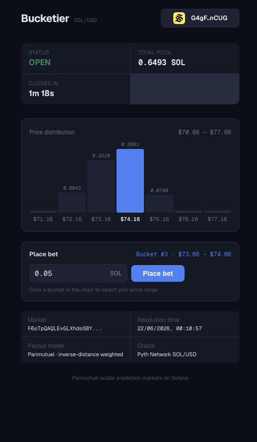
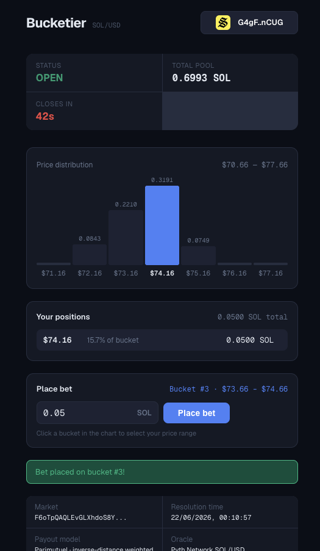
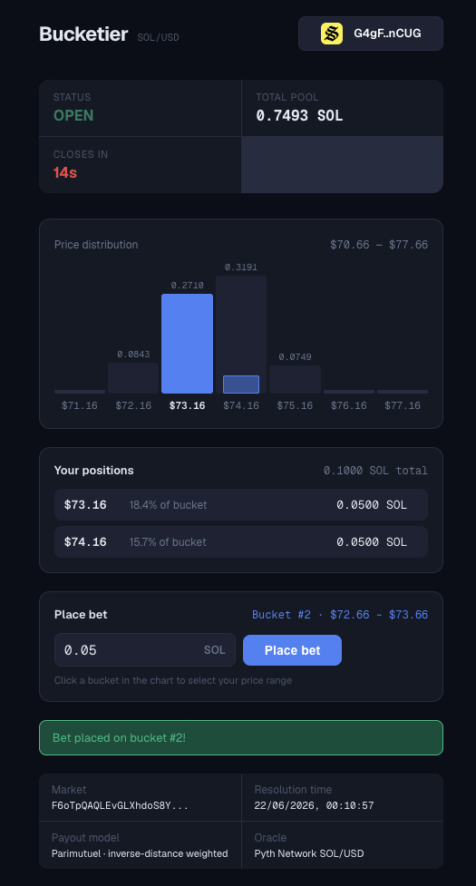
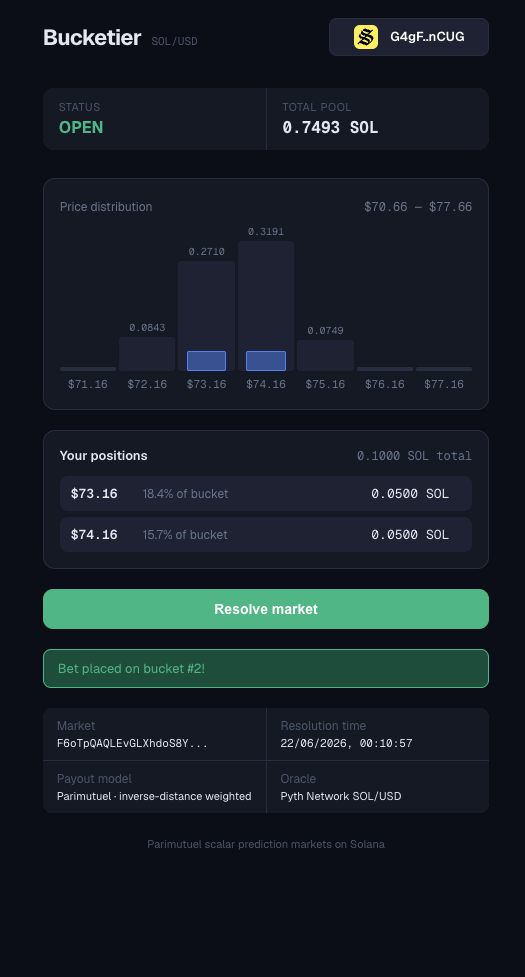
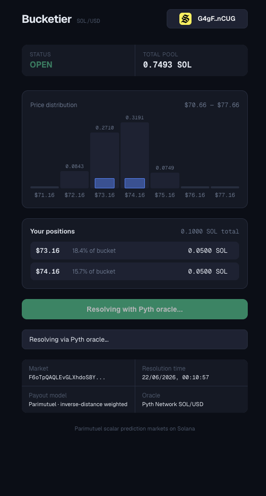
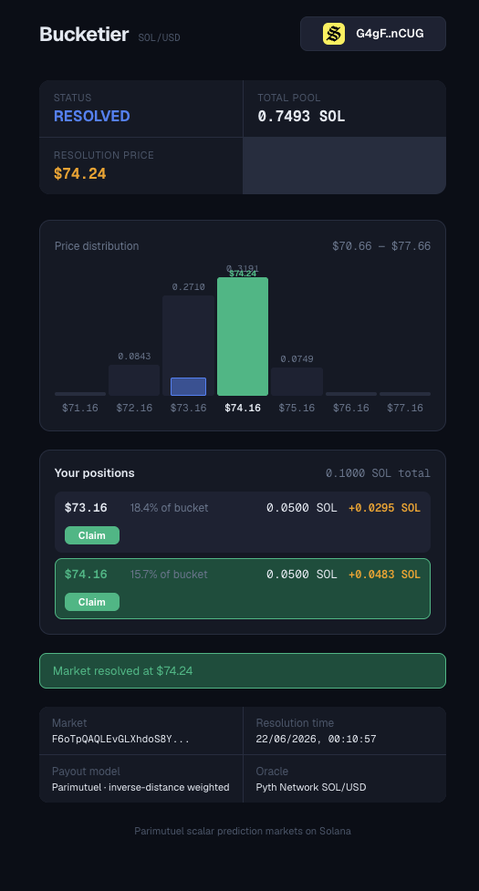
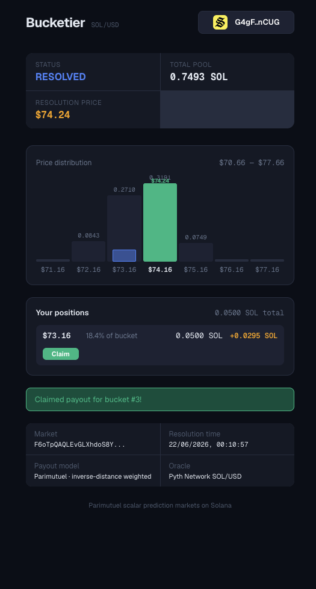
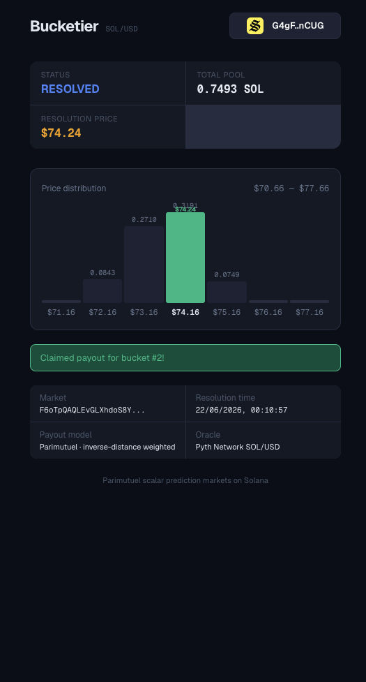

# Bucketier

Parimutuel scalar prediction market protocol on Solana. Users bet on price buckets; payouts follow an inverse-distance gradient where closer predictions earn more per lamport staked.

**Program ID (Devnet):** `3YPmf5odBQdY3dbNWeTVk96EkGKumwvQnwGed4x8DrGA`

Built for the [Turbin3](https://x.com/solanaturbine) Builders Cohort Q2 2026 capstone.

## Demo — Full Market Lifecycle

A live walkthrough on devnet: market seeded with 5 bot wallets, user places bets, market resolves via Pyth oracle, payouts claimed.

### 1. Open Market — Seeded Pool

Market open with 0.65 SOL pooled across 7 buckets by bot wallets. User selects bucket #3 ($73.66–$74.66) to bet on.

<p align="center"></p>

### 2. First Bet Placed

0.05 SOL bet placed on bucket #3. Position appears showing 15.7% share of that bucket. Pool grows to 0.70 SOL.

<p align="center"></p>

### 3. Second Bet — Multiple Positions

Another 0.05 SOL on bucket #2 ($72.66–$73.66). User now holds two positions totaling 0.10 SOL across two buckets.

<p align="center"></p>

### 4. Betting Closed — Resolve Available

Betting window expired. "Resolve market" button appears — anyone can trigger resolution permissionlessly.

<p align="center"></p>

### 5. Resolving with Pyth Oracle

Resolution in progress — fetching historical SOL/USD price from Pyth Benchmarks at the exact resolution timestamp.

<p align="center"></p>

### 6. Market Resolved — Payouts Ready

Pyth returned $74.24. Bucket #3 (containing $74.24) turns green as the winning bucket. Inverse-distance payouts calculated — bucket #3 position shows +0.0483 SOL, bucket #2 shows +0.0295 SOL. Closer bucket earns more.

<p align="center"></p>

### 7. Claiming Payouts

Bucket #3 claimed. Position closed on-chain (double-claim protection). Remaining bucket #2 position still available to claim.

<p align="center"></p>

### 8. All Positions Claimed

Both payouts collected. All position accounts closed. Rounding dust (sub-lamport) remains in vault.

<p align="center"></p>

---

## How It Works

### Concept

Traditional prediction markets use binary yes/no outcomes. Bucketier divides a continuous price range into **buckets** (e.g., 7 buckets of $1 each covering $68-$75 for SOL/USD). Users bet on which bucket the price will land in at resolution time.

The twist: **every funded bucket gets paid** — not just the winning one. Payouts are weighted by inverse distance to the actual outcome. A bet on the exact bucket earns the most per lamport, but even distant bets get something back, proportional to how close they were.

### Payout Math

Weight per bucket:

```
W = SCALE^2 / (D_normalized + SCALE)
```

Where `D_normalized = distance * SCALE / bucket_width` — distance in bucket-width units.

- Bet on the exact midpoint: `W = SCALE` (maximum)
- One bucket away: `W = SCALE / 2`
- Two buckets away: `W = SCALE / 3`

Only **funded buckets** (buckets with at least one bet) contribute to the weight sum. Unfunded buckets are excluded entirely — they don't dilute the payout pool.

Individual payout:

```
payout = (user_amount / bucket_total) * (bucket_weight / sum_weights) * total_pool
```

This ensures:
- Pool conservation: total payouts never exceed the pool (dust bounded by position count)
- Monotonicity: closer buckets always earn more per lamport than farther ones
- Proportionality: within a bucket, payout is proportional to stake

Both properties are verified by proptest fuzz tests in `math.rs`.

### Worked Example: 7-Bucket SOL/USD Market

**Setup:** SOL is trading at ~$71.50. Market creates 7 buckets × $1.00 wide, covering $68–$75.

```
Bucket #0: $68.00–$69.00  (midpoint: $68.50)
Bucket #1: $69.00–$70.00  (midpoint: $69.50)
Bucket #2: $70.00–$71.00  (midpoint: $70.50)
Bucket #3: $71.00–$72.00  (midpoint: $71.50)  ← center
Bucket #4: $72.00–$73.00  (midpoint: $72.50)
Bucket #5: $73.00–$74.00  (midpoint: $73.50)
Bucket #6: $74.00–$75.00  (midpoint: $74.50)
```

**Bets placed (5 participants):**

| Bettor | Bucket | Amount |
|--------|--------|--------|
| Alice  | #2     | 0.08 SOL |
| Bob    | #3     | 0.12 SOL |
| Carol  | #3     | 0.05 SOL |
| Dave   | #5     | 0.10 SOL |
| Eve    | #6     | 0.06 SOL |

Bucket #0, #1, #4 have no bets (unfunded — excluded from weight sum).

**Total pool = 0.41 SOL**

Bucket totals: `#2: 0.08, #3: 0.17, #5: 0.10, #6: 0.06`

---

**Resolution:** Pyth oracle delivers SOL/USD = **$71.48** at resolution time.

**Step 1 — Clamp outcome to midpoint range:**

X = clamp($71.48, $68.50, $74.50) = $71.48 (already in range)

**Step 2 — Compute distances (midpoint to outcome):**

```
d_2 = |$71.48 − $70.50| = $0.98   (0.98 bucket-widths)
d_3 = |$71.48 − $71.50| = $0.02   (0.02 bucket-widths)  ← closest!
d_5 = |$71.48 − $73.50| = $2.02   (2.02 bucket-widths)
d_6 = |$71.48 − $74.50| = $3.02   (3.02 bucket-widths)
```

**Step 3 — Normalize and compute weights:**

Formula: `W = SCALE² / (Dn + SCALE)` where `Dn = distance × SCALE / bucket_width`

```
Dn_2 = 0.98 × 10^9 = 980,000,000
Dn_3 = 0.02 × 10^9 =  20,000,000
Dn_5 = 2.02 × 10^9 = 2,020,000,000
Dn_6 = 3.02 × 10^9 = 3,020,000,000

W_2 = 10^18 / (980M + 1000M)  = 505,050,505   (~0.505 SCALE)
W_3 = 10^18 / (20M  + 1000M)  = 980,392,156   (~0.980 SCALE) ← highest!
W_5 = 10^18 / (2020M + 1000M) = 331,125,827   (~0.331 SCALE)
W_6 = 10^18 / (3020M + 1000M) = 248,756,218   (~0.249 SCALE)
```

**Step 4 — Sum weights (funded buckets only):**

```
S = W_2 + W_3 + W_5 + W_6
  = 505M + 980M + 331M + 249M
  = 2,065,324,706
```

**Step 5 — Pool share per bucket:**

```
Bucket #2: 505M / 2065M = 24.5%  → 0.1003 SOL from pool
Bucket #3: 980M / 2065M = 47.5%  → 0.1947 SOL from pool
Bucket #5: 331M / 2065M = 16.0%  → 0.0657 SOL from pool
Bucket #6: 249M / 2065M = 12.0%  → 0.0494 SOL from pool
```

**Step 6 — Individual payouts (proportional within bucket):**

```
Alice (#2, sole bettor): 0.08/0.08 × 0.1003 = 0.1003 SOL  (bet 0.08, profit +0.02)
Bob   (#3, 0.12 of 0.17): 0.12/0.17 × 0.1947 = 0.1374 SOL  (bet 0.12, profit +0.02)
Carol (#3, 0.05 of 0.17): 0.05/0.17 × 0.1947 = 0.0573 SOL  (bet 0.05, profit +0.01)
Dave  (#5, sole bettor): 0.10/0.10 × 0.0657 = 0.0657 SOL  (bet 0.10, loss −0.03)
Eve   (#6, sole bettor): 0.06/0.06 × 0.0494 = 0.0494 SOL  (bet 0.06, loss −0.01)
```

**Verification:** 0.1003 + 0.1374 + 0.0573 + 0.0657 + 0.0494 = 0.4101 ≈ 0.41 SOL ✓ (sub-lamport dust from truncation)

**Key takeaways:**
- Bucket #3 ($71–$72) was closest to outcome $71.48 → gets 47.5% of pool
- Even far-away bucket #6 still gets 12% — "close but wrong" isn't zero
- Within bucket #3, Bob and Carol split proportionally by stake (70.6% / 29.4%)
- Unfunded buckets (#0, #1, #4) don't dilute the pool — their weight is excluded from sum

### Oracle Integration

Resolution uses [Pyth Network](https://pyth.network/) price feeds — specifically the **Pyth Receiver** program on Solana (`rec5EKMGg6MxZYaMdyBfgwp4d5rB9T1VQH5pJv5LtFJ`).

The on-chain program validates:
- **Owner check**: price update account must be owned by Pyth Receiver (no forged accounts)
- **Feed ID match**: must match the market's configured feed
- **Publish time tolerance**: `|publish_time - resolution_time| <= 60 seconds`
- **Price sanity**: price must be positive
- **Confidence band**: `confidence / price <= 2%` (rejects stale or illiquid feeds)

No Pyth SDK used on-chain — hand-rolled deserialization of `PriceUpdateV2` for zero dependency overhead.

## Architecture

> Full architecture doc with flows: [architecture_diagram_v2.md](https://gist.github.com/apsc9/e86631f36957008d944216feeb46a36b)

```
programs/bucketier/src/
  lib.rs              # Program entry — 6 instructions
  state.rs            # Market + Position accounts, constants
  math.rs             # Payout math + proptest fuzz suite
  pyth.rs             # Oracle deserialization + constants
  errors.rs           # Custom error codes
  instructions/
    create_market.rs   # Initialize market PDA + vault
    place_bet.rs       # Bet on a bucket (init_if_needed position)
    resolve_market.rs  # Consume Pyth price, compute weights
    claim.rs           # Claim payout (closes position)
    cancel_market.rs   # Authority cancel (empty) or permissionless (past deadline)
    claim_refund.rs    # Full refund on canceled market (closes position)
```

### Account Structure

| Account | Seeds | Purpose |
|---------|-------|---------|
| `Market` | `["market", authority, market_id]` | Market config, bucket totals, state, outcome |
| `Vault` | `["vault", market]` | System-owned PDA holding the pool lamports |
| `Position` | `["position", market, owner, bucket_index]` | Per-user per-bucket stake. Closed on claim/refund (double-claim protection) |

### Market Lifecycle

```
Open ──bet──> Open ──resolve──> Resolved ──claim──> (positions closed)
  │                                                         
  └──cancel──> Canceled ──refund──> (positions closed, stakes returned)
```

**Cancel conditions:**
- Authority can cancel if pool is empty (cleanup)
- Anyone can cancel after `resolve_deadline` passes (oracle failure backstop)

## Instructions

| Instruction | Signer | Description |
|-------------|--------|-------------|
| `create_market` | authority | Create market with feed, buckets, timestamps, min bet |
| `place_bet` | bettor | Bet on bucket index with amount (must be >= min_bet) |
| `resolve_market` | anyone | Submit Pyth price update to resolve. Permissionless. |
| `claim` | position owner | Claim inverse-distance payout. Closes position account. |
| `cancel_market` | authority or anyone (after deadline) | Cancel unresolved market |
| `claim_refund` | position owner | Claim full refund on canceled market. Closes position. |

## Build

Prerequisites: Rust, Solana CLI, Anchor CLI (v1.0.2+), Node.js

```bash
# Install dependencies
yarn install

# Build program
anchor build

# Run Rust unit tests (math + proptest fuzz)
cargo test -p bucketier

# Deploy to devnet
solana config set --url devnet
anchor deploy --provider.cluster devnet
```

## Test (Devnet)

Full integration test suite runs against the live devnet program with real Pyth oracle data.

```bash
# Set up .env with your RPC endpoint
cp .env.example .env
# Edit .env with your Helius (or other) devnet RPC URL

# Run tests
source .env && anchor test --skip-deploy --skip-local-validator --provider.cluster "$HELIUS_DEVNET_RPC"
```

### Test Suite

| # | Test | What it proves |
|---|------|----------------|
| 1 | Create market | PDA derivation, bucket layout, state initialization |
| 2 | Reject invalid timestamps | `resolutionTime < bettingClose` rejected |
| 3 | Place bet + pool update | Lamport transfer to vault, bucket total tracking |
| 4 | Reject out-of-range bucket | Bucket index bounds checking |
| 5 | Authority cancel empty market | Authority-only cancel when pool is empty |
| 6 | **Full lifecycle (multi-wallet)** | Core protocol mechanic — 2 wallets, 3 buckets, Pyth resolution, inverse-distance gradient verification, pool conservation |
| 7 | Cancel + refund | Oracle failure scenario, permissionless cancel, full stake refund |

### Test Output (Devnet)

```
  bucketier devnet

  ═══════════════════════════════════════════════════════
  Program ID: 3YPmf5odBQdY3dbNWeTVk96EkGKumwvQnwGed4x8DrGA
  Authority:  6QLH6XaUB5UYw96MAxhG5nvadjYes5aBR8RCX8VTzGmP
  Run ID:     397 (unique market IDs to avoid PDA collisions)
  ───────────────────────────────────────────────────────
  Pyth Hermes SOL/USD spot: $71.50
  Bucket layout: 7 buckets × $1.00 wide, centered on spot
  Range: $68.00 → $75.00

  [0] $68.00 – $69.00 (mid: $68.50)
  [1] $69.00 – $70.00 (mid: $69.50)
  [2] $70.00 – $71.00 (mid: $70.50)
  [3] $71.00 – $72.00 (mid: $71.50)
  [4] $72.00 – $73.00 (mid: $72.50)
  [5] $73.00 – $74.00 (mid: $73.50)
  [6] $74.00 – $75.00 (mid: $74.50)
  ═══════════════════════════════════════════════════════

    Creating market #397...
      Market PDA:  E6N511tquWR9KfsUEnJPvMSkuQFuy7f8HVwSbNFzsWZh
      Vault PDA:   4r3eYbXTtJSLHGQZZi6wFhA6xorfTwEQcKZrSTVWoBcA
      Params: 7 buckets, start=$68.00, width=$1.00
      Min bet: 0.0100 SOL
      Betting window: 30s (4:05:23 PM → 4:05:53 PM)
      Resolution time: 4:05:53 PM
      ✓ Market created — state: open, pool: 0 SOL
    ✔ creates a market with valid params (6738ms)
    Attempting to create market #398 with invalid timestamps...
      bettingClose = now + 100s, but resolutionTime = now + 50s
      Rule violated: resolutionTime must be >= bettingClose
      ✓ Correctly rejected with InvalidTimeStamps
    ✔ rejects market with invalid timestamps (4193ms)
    Creating market #407 for bet test...
    Placing bet on bucket #3 ($71.00 – $72.00)...
      Bet amount: 0.0200 SOL
      ✓ Bet placed — pool: 0.0200 SOL, bucket[3]: 0.0200 SOL
    ✔ places a bet and updates pool (5901ms)
    Creating market #408 with 7 buckets (valid indices: 0–6)...
    Attempting bet on bucket #8 (out of range, max valid: 6)...
      ✓ Correctly rejected with InvalidBucket (bucket 8 >= num_buckets 7)
    ✔ rejects bet on out-of-range bucket (2782ms)
    Creating market #417 (will cancel immediately)...
    Authority (6QLH6XaU...) cancelling empty market...
      Pool is empty (0 SOL) → authority allowed to cancel
      ✓ Market canceled — state: canceled
    ✔ authority can cancel an empty market (7409ms)

    ── FULL LIFECYCLE TEST (multi-wallet) ──
    Step 1: Create market #497
      Resolution in 35s at 4:06:25 PM
      Bucket range: $68.00 → $75.00
      ✓ Market created — state: open
    Step 2: Create second wallet + fund from authority
      Wallet A (authority): 6QLH6XaU...
      Wallet B (generated): AWhBpmfi...
      Funded Wallet B with 0.1000 SOL from Wallet A
    Step 3: Place bets from multiple wallets on different buckets
      Wallet A → bucket #2 ($70.00 – $71.00) — 0.0200 SOL
      Wallet A → bucket #3 ($71.00 – $72.00) — 0.0200 SOL
      Wallet B → bucket #5 ($73.00 – $74.00) — 0.0300 SOL

      Pool state after all bets:
        Total pool: 0.0700 SOL
        Bucket #2 ($70.00 – $71.00): 0.0200 SOL
        Bucket #3 ($71.00 – $72.00): 0.0200 SOL
        Bucket #5 ($73.00 – $74.00): 0.0300 SOL
        Unfunded buckets: 4 of 7 (excluded from payout weight sum)

    Step 4: Wait for resolution time
      Waiting 21s for resolution_time + 5s buffer...
    Step 5: Resolve with Pyth Benchmarks
      Fetching historical SOL/USD price at unix timestamp 1781951785...
      Program validates: feed_id match, |publish_time − resolution_time| ≤ 60s, price > 0, conf ≤ 2%
      Resolve attempt 1 failed (Benchmarks may not have data yet), retrying in 5s...
      ✓ Market resolved!
        Outcome price: $71.48
        Closest bucket: #3 ($71.00 – $72.00)

        Distance from each funded bucket to outcome:
          Wallet A bet 1: bucket #2 (mid: $70.50) — distance: $0.98 
          Wallet A bet 2: bucket #3 (mid: $71.50) — distance: $0.02 ← CLOSEST
          Wallet B bet: bucket #5 (mid: $73.50) — distance: $2.02 

    Step 6: Claims — verify inverse-distance graduated payouts
      Payout rule: W = SCALE² / (distance + SCALE). Closer bucket → higher weight → bigger share.
      Only funded buckets contribute to weight sum (unfunded buckets ignored).
      Wallet A bucket #2 payout: ~0.0209 SOL (0.0200 SOL staked)
      Wallet A bucket #3 payout: ~0.0392 SOL (0.0200 SOL staked)
      Wallet B bucket #5 payout: ~0.0142 SOL (0.0300 SOL staked)

      Per-lamport returns (inverse-distance gradient check):
        Bucket #3 (dist $0.02): 1.9618 per lamport staked
        Bucket #5 (dist $2.02): 0.4739 per lamport staked
        ✓ Closer bucket (#3) earned more per lamport than farther bucket (#5)

      Vault after all claims: 0.0009 SOL (rent floor: 0.0009 SOL, dust: 1 lamports)
      ✓ Pool conserved — dust < number of positions (1 < 3)
      ✓ All 3 position accounts closed (double-claim protection)

    ✔ full lifecycle: multi-wallet bets, resolve with Pyth, graduated payouts (82457ms)

    ── CANCEL + REFUND TEST ──
    Scenario: market with bets, oracle never resolves → permissionless cancel → full refund
    Step 1: Create market #597 with short resolve_deadline (35s)
      ✓ Market created — betting closes in 15s, resolve deadline in 35s
    Step 2: Place bet on bucket #2 — 0.0200 SOL
      ✓ Bet placed — pool: 0.0200 SOL
    Step 3: Wait for resolve_deadline to pass
      Simulating oracle failure — no one resolves the market
      Waiting 31s for deadline to expire...
    Step 4: Permissionless cancel (deadline passed, anyone can call)
      ✓ Market canceled — state: canceled
    Step 5: Claim refund (full stake returned)
      ✓ Refunded ~0.0215 SOL (stake + position rent reclaim, minus tx fee)
      ✓ Position account closed (double-refund protection)

    ✔ cancel and refund returns stake (55471ms)


  7 passing (3m)
```

## Tech Stack

- **Solana** — runtime
- **Anchor** v1.0.2 — program framework
- **Pyth Network** — price oracle (hand-rolled on-chain deserialization, no SDK)
- **TypeScript + Mocha** — integration tests
- **Proptest** — Rust fuzz testing for payout math invariants

## License

ISC
